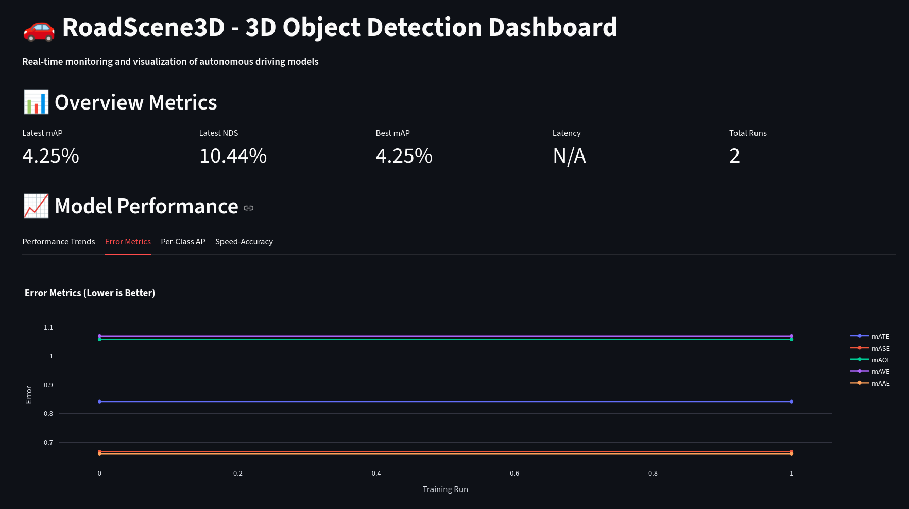
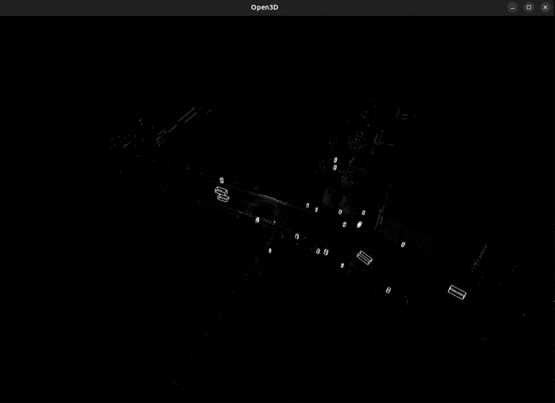

# RoadScene3D

**End-to-End 3D Object Detection Pipeline for Autonomous Driving**

[](https://www.python.org/downloads/)
[](https://pytorch.org/)
[](https://opensource.org/licenses/MIT)

> **A production-ready 3D object detection system with automated training pipelines, experiment tracking, and continuous learning capabilities.**

## Visualizations

<div align="center">

### Interactive Streamlit Dashboard


### MLflow Experiment Tracking


### 3D Point Cloud Visualization


</div>


## What is RoadScene3D?

RoadScene3D is an **MLOps-ready** 3D object detection pipeline that detects vehicles, pedestrians, and other objects in LiDAR point clouds. It's designed for autonomous driving applications with a focus on:

- **Automated Training Pipelines** - Continuous model improvement with active learning
- **Experiment Tracking** - MLflow integration for model versioning and metrics
- **Rich Visualizations** - Interactive dashboards and 3D point cloud visualizations
- **Production Optimization** - Model quantization and inference acceleration
- **Flywheel Architecture** - Self-improving system with automated retraining


## 🚀 Quick Start

### 1. Install Dependencies

```bash
# Create Python environment with uv
uv venv
source .venv/bin/activate  # On Windows: .venv\Scripts\activate

# Install core dependencies
uv pip install -r requirements.txt

# Install MMDetection3D (see installation guide)
bash scripts/install_mmdet3d.sh
```

### 2. Download Dataset

```bash
# Download nuScenes mini dataset
python scripts/download_nuscenes.py
```

### 3. Train Baseline Model

```bash
# Train with MLflow logging
python scripts/train_with_mlflow.py configs/pointpillars_nuscenes_mini.py \
    --work-dir work_dirs/baseline \
    --mlflow-tracking-uri ./mlruns
```

### 4. View Results

**Streamlit Dashboard:**
```bash
streamlit run dashboard/app.py
```

**MLflow UI:**
```bash
bash scripts/start_mlflow_server.sh
# Open http://localhost:5000
```

##  Project Architecture

```
RoadScene3D/
├── 📁 src/
│   ├── data/          # Dataset loaders (nuScenes, Waymo)
│   ├── training/      # Training scripts with MLflow integration
│   ├── evaluation/    # Metrics and evaluation tools
│   ├── visualization/ # 3D point cloud visualization
│   ├── flywheel/      # Active learning & automated retraining
│   ├── models/        # Model registry (MLflow)
│   └── optimization/  # Quantization & OpenVINO export
│
├── 📁 dashboard/      # Streamlit dashboard
├── 📁 configs/        # Model configurations
├── 📁 scripts/        # Utility scripts
└── 📁 docs/           # Documentation
```

## Features

### Experiment Tracking with MLflow

Track every training run with automatic metric logging:

```python
from src.training.mlflow_logger import MLflowLogger

mlflow_logger = MLflowLogger(experiment_name="roadscene3d")
with mlflow_logger.start_run():
    mlflow_logger.log_config("configs/pointpillars_nuscenes_mini.py")
    mlflow_logger.log_params({"batch_size": 1, "lr": 0.001})
    # ... training code ...
    mlflow_logger.log_nuscenes_metrics("work_dirs/eval/metrics_summary.json")
```

**Track:**
- mAP, NDS, and error metrics
- Inference latency and throughput
- Per-class performance
- Model checkpoints and versions

### Interactive Dashboard

Beautiful Streamlit dashboard for non-technical stakeholders:

```bash
streamlit run dashboard/app.py
```

**Features:**
- Real-time performance metrics
- mAP progression charts
- Per-class accuracy breakdown
- Speed-accuracy trade-off analysis
- Model registry status

### 3D Visualization

Visualize predictions on point clouds:

```bash
python scripts/visualize_predictions.py \
    configs/pointpillars_nuscenes_mini.py \
    work_dirs/baseline/epoch_40.pth \
    --sample-idx 0 \
    --show
```

### Automated Retraining Pipeline

Self-improving system with Prefect orchestration:

```python
from src.flywheel.prefect_workflow import automated_retraining_flow

# Runs automatically on new data
result = automated_retraining_flow(
    data_path="data/unlabeled",
    tracking_uri="./mlruns"
)
```

**Pipeline Flow:**
1. Detect new unlabeled data
2. Active learning: Select uncertain samples
3. Generate pseudo-labels
4. Retrain model
5. Evaluate and register if quality gates pass

### Active Learning

Intelligent sample selection for efficient labeling:

```python
from src.flywheel.active_learning import UncertaintySampler, ActiveLearningPipeline

sampler = UncertaintySampler(strategy='entropy', top_k=100)
pipeline = ActiveLearningPipeline(
    model=model,
    labeled_data=train_set,
    unlabeled_data=unlabeled_pool,
    uncertainty_sampler=sampler,
    device=device
)

# Run active learning iteration
results = pipeline.run_iteration()
```

## Current Results

**Baseline Model (PointPillars on nuScenes mini):**

| Metric | Value |
|--------|-------|
| **mAP** | **4.25%** |
| **NDS** | **10.44%** |
| **Car AP** | 25.18% |
| **Pedestrian AP** | 17.31% |
| **Latency** | ~30ms (Local Laptop RTX 4070) |

*Note: Results are on nuScenes mini (323 training samples). Full dataset expected to achieve 15-25% mAP.*


## Usage Examples

### Training with MLflow

```bash
python scripts/train_with_mlflow.py \
    configs/pointpillars_nuscenes_mini.py \
    --work-dir work_dirs/my_experiment \
    --mlflow-experiment roadscene3d \
    --run-name my_experiment_v1
```

### Evaluation

```bash
python scripts/evaluate_model.py \
    --config configs/pointpillars_nuscenes_mini.py \
    --checkpoint work_dirs/baseline/epoch_40.pth \
    --benchmark \
    --num-samples 100
```

### Register Model in MLflow

```python
from src.models.registry import ModelRegistry

registry = ModelRegistry()
registry.register_model(
    model_path="work_dirs/baseline/epoch_40.pth",
    metrics={"mAP": 0.0425, "NDS": 0.1044},
    metadata={"dataset": "nuscenes-mini", "epochs": 40},
    stage="Staging"
)
```

<!-- ## System Components

### Data Pipeline
- ✅ nuScenes dataset integration
- ✅ Waymo dataset support (planned)
- ✅ Custom data loaders
- ✅ Data augmentation

### Training Infrastructure
- ✅ MMDetection3D integration
- ✅ Automatic MLflow logging
- ✅ Memory-optimized training (8GB VRAM)
- ✅ Distributed training support

### Evaluation & Metrics
- ✅ nuScenes evaluation metrics (mAP, NDS, errors)
- ✅ Inference speed benchmarking
- ✅ Per-class performance analysis
- ✅ Golden test set support

### MLOps & Automation
- ✅ MLflow model registry
- ✅ Active learning pipeline
- ✅ Automated retraining (Prefect)
- ✅ Quality gates and versioning

### Visualization
- ✅ 3D point cloud visualization
- ✅ Interactive Streamlit dashboard
- ✅ MLflow UI integration
- ✅ Performance charts -->

## Documentation

- **[Training Results](docs/TRAINING_RESULTS.md)** - Detailed performance analysis
- **[Installation Guide](docs/ENV_SETUP.md)** - Environment setup
- **[Dataset Guide](docs/NUSCENES_DOWNLOAD.md)** - Dataset download instructions

<!-- 
## 🎯 Roadmap

### Phase 1: Foundation ✅
- [x] Baseline model training
- [x] MLflow integration
- [x] Evaluation metrics
- [x] Basic visualization

### Phase 2: Automation (Current) 🔄
- [x] MLflow model registry
- [x] Streamlit dashboard
- [x] Active learning pipeline
- [x] Prefect workflow
- [ ] CI/CD with evaluation gates

### Phase 3: Optimization 📅
- [ ] Model quantization (INT8)
- [ ] OpenVINO export
- [ ] Inference acceleration
- [ ] Latency optimization

### Phase 4: Advanced Features 📅
- [ ] Self-supervised pretraining
- [ ] Multi-frame temporal fusion
- [ ] Advanced data augmentation
- [ ] Model ensemble -->


## Acknowledgments

- [MMDetection3D](https://github.com/open-mmlab/mmdetection3d) - 3D detection framework
- [nuScenes](https://www.nuscenes.org/) - Dataset
- [MLflow](https://mlflow.org/) - Experiment tracking
- [Streamlit](https://streamlit.io/) - Dashboard framework
